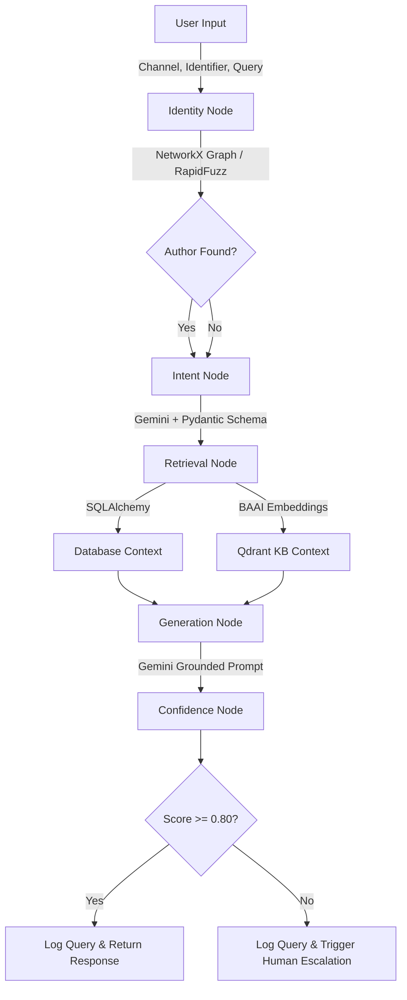

# BookLeaf AI Query Bot

A Staff-level AI automation system engineered for BookLeaf's author query workflows. This project replaces traditional linear chatbots with a robust, state-managed Agentic workflow, featuring hybrid Retrieval-Augmented Generation (RAG) and multi-layer identity resolution.

## Technical Architecture & Rationale

This project was built with production readiness as the primary constraint. 

### Core Tech Stack

| Component | Technology | Rationale |
| :--- | :--- | :--- |
| **Backend Framework** | FastAPI (Async) | Provides a high-performance, non-blocking asynchronous event loop, ensuring database queries and LLM API calls never stall the server. |
| **AI Orchestration** | LangGraph | Replaces brittle linear chains with explicit state machines. Enables predictable execution, conditional routing, and safe human-in-the-loop escalation. |
| **Schema Validation** | Pydantic | Enforces strict schema validation for the Gemini API, guaranteeing deterministic, machine-readable JSON for intent classification without hallucination. |
| **LLM Engine** | Google GenAI (Gemini) | Serves as the core intelligence for fast intent routing and accurate, grounded response generation. |
| **Vector Database** | Qdrant (Local) | A standalone vector engine that rapidly processes semantic queries, retrieving precise Knowledge Base chunks. |
| **Embeddings** | SentenceTransformers (BAAI) | Uses the `BAAI/bge-small-en-v1.5` model for rapid, CPU-bound dense vector generation without external API latency or costs. |
| **Database** | SQLite & SQLAlchemy | Persistent, asynchronous storage utilizing the Repository pattern. Mirrors production Supabase schemas for easy deployment swapping. |
| **Identity Unification** | NetworkX & RapidFuzz | Solves multi-platform identities. Uses fuzzy string matching and multi-hop graph traversal rather than brittle SQL joins. |
| **Observability** | Structlog & Tenacity | Deep, JSON-formatted logging combined with exponential backoff (`Tenacity`) for resilient, highly observable API interactions. |
| **User Interface** | Streamlit | A reactive, partitioned dashboard allowing reviewers to easily simulate multi-channel queries and inspect internal state. |

### System Lifecycle Features

| Feature | Implementation | Assignment Value |
| :--- | :--- | :--- |
| **3-Layer Identity Resolution** | Deterministic Match -> Fuzzy Logic -> Graph Traversal & LLM Semantic Fallback | Resolves the "Intermediate Task" by securely linking disparate social handles (Email, WhatsApp, Instagram). |
| **Confidence-Gated Escalation** | Multi-variable scoring (Intent certainty + Author match + Citation density). | If confidence < 80%, the query is cleanly flagged and logged for human review without crashing or lying to the user. |
| **Grounded RAG Responses** | Strict system prompts enforce `[source_id]` citations. | Prevents the LLM from fabricating dates, ISBNs, or royalty amounts. |
| **Graceful Degradation** | Asynchronous `try/except` blocks surrounding DB/LLM calls. | If the database fails, the bot fails gracefully and notifies the user, meeting robustness requirements. |

## Request Flow

